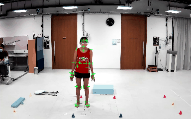
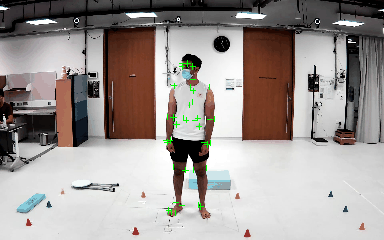

# RRIS40 Test Dataset
This dataset is a set of spatially aligned and temporally synchronized records of random human movements from a marker-based motion capture system and eight video cameras. The main purpose of this dataset is to benchmark the 3D accuracy of any multi-camera human motion capture method.  

 | 
 | 
 | 
 | 
 | 

## Specifications
- 10 subjects
- total of about 0.1 million frames (8 images per frame) with raw 3D marker positions.
- 3D data from a marker-based motion capture system (Qualisys)
    - 200 fps
    - positions of 40+6 markers in TSV format (Labels and definitions of all markers can be found [here](https://koonyook.github.io/rris40/markers))
- Data from RGB Video Cameras
    - 8 synchronized global shutter cameras
    - 1920 x 1200 resolution
    - 50 fps
    - h.264 encoding
    - intrinsic calibration parameters
    - extrinsic calibration parameters (in the Qualisys coordinate reference frame)
- Frame-level hardware synchronization is used between Qualisys' Miqus sync unit and all the RGB cameras. 
- The formulation to interpolate 3D marker positions at the center of frame exposure time and projection to the video frame is provided in the data viewer source code.  
    
## Organization
- Data from each subject is stored in one zip file such as SN123g.zip or FT321g.zip. Each zip file contains one or more record folders inside.
- Each record folder has the following structure
    - **YYYY-MM-DD-HH-mm-ss/** is called a record folder which contains data from only one continuous record.
        - **qualisys.tsv** contains data from the marker-based motion capture system
        - **metadata.pkl** contains metadata on the video record
        - **systemCalibration.pkl** contains calibration parameters of all the video cameras
        - **keepMarker{camera_id}.h264** contains encoded video content.
        - **keepMarker{camera_id}.seek** Do not remove this file.
        - **frameInfo{camera_id}.dat** Do not remove this file. 
    
## Download
You can download them [here](https://entuedu-my.sharepoint.com/:f:/g/personal/guanming001_e_ntu_edu_sg/Ei3fcq8jXB1DoueH6PK0V98BcIF1uPC_qA5xAkO_VQHJsA) or with [mirror link](https://e.pcloud.link/publink/show?code=kZ95nxZxG6jQ8Fo7eVopdemakSDBXPyoISy).
Password can be found in the paper.

**WARNING**: All the files are ~21GB in total.

## Want to visualize the dataset quickly?
The runnable Python source code is available [here](https://github.com/koonyook/rris40DataViewer). It simply playback a video with an overlay of 2D marker projections. This code allows you to understand our file structure to continue your work.

# Cite Us
If you gain something from our dataset, please cite our [publication](https://doi.org/10.1109/JBHI.2024.3424869).
Volume and number will be updated after the official release. Note that you can cite an early access article with this [IEEE guideline](https://journals.ieeeauthorcenter.ieee.org/wp-content/uploads/sites/7/IEEE_Reference_Guide.pdf). 

```
@ARTICLE{10591328,
  author={Jatesiktat, Prayook and Lim, Guan Ming and Lim, Wee Sen and Ang, Wei Tech},
  journal={IEEE Journal of Biomedical and Health Informatics}, 
  title={Anatomical-Marker-Driven 3D Markerless Human Motion Capture}, 
  year={2024},
  volume={},
  number={},
  pages={1-14},
  keywords={Three-dimensional displays;Solid modeling;Motion capture;Feature extraction;Deep learning;Cameras;Accuracy;Anatomical landmarks;biomechanics;data collection;deep learning;markerless motion capture},
  doi={10.1109/JBHI.2024.3424869}
}
```

# Additional Paper Supplementary

## Qualitative Results 
- Videos of qualitative results on assistive outfits are accessible through this [link](https://entuedu-my.sharepoint.com/:f:/g/personal/guanming001_e_ntu_edu_sg/EiI-kItTnDBFuzJGuHU0134BKuuj2CJIjEhVlsri73G4ig?e=mL67k1) or this [mirror link](https://e.pcloud.link/publink/show?code=kZx5nxZQIpsSxuFNJhAzmDluIe2Xy7FjuBX).

# Contact Us
- Prayook Jatesiktat. prayook001[at]e[dot]ntu[dot]edu[dot]sg
- Guan Ming Lim. guanming001[at]e[dot]ntu[dot]edu[dot]sg

We are from Nanyang Technological University.
